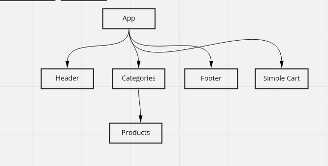

# React - storefront

### Available Scripts

In the project directory, you can run:

* `npm start`
* `npm test`
* `npm run build`
* `npm run lint`

### UML

### Phases

1. `Phase1`
Create a visually appealing site using Material UI  
Use a Redux Store to manage the state of categories and items in the store
Display a list of categories from state  
When the user selects (clicks on) a category …  
    Identify that category as selected (change of class/display)  
    Show a list of products associated with the category  
2. `Phase2`
We will be adding the “Add to Cart” feature to our application, which will allow our users to not only browse items in the store, but also select them and have them persist in their “shopping cart” for later purchase.
3. `Phase3`
Get categories and products from API
4. `Phase4`
Add a cart checkout page
Add a product details page
