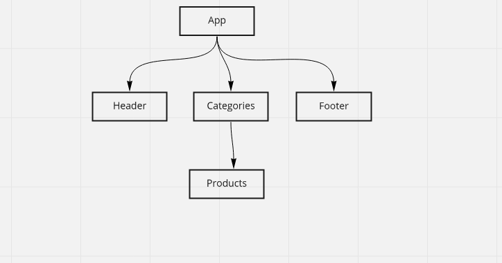

# React - storefront

### Available Scripts

In the project directory, you can run:

* `npm start`
* `npm test`
* `npm run build`
* `npm run lint`

### UML

### Phases

1. `Phase1`
Create a visually appealing site using Material UI  
Use a Redux Store to manage the state of categories and items in the store
Display a list of categories from state  
When the user selects (clicks on) a category …  
    Identify that category as selected (change of class/display)  
    Show a list of products associated with the category  
